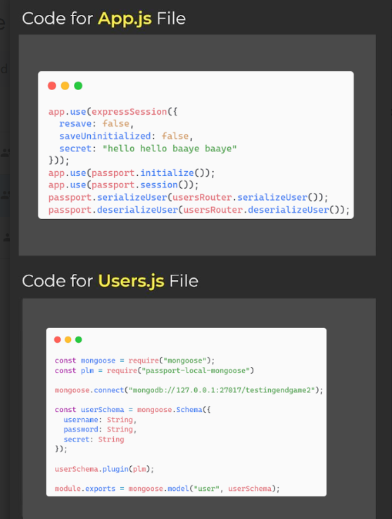
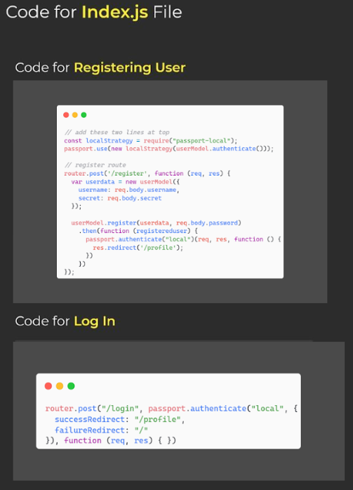
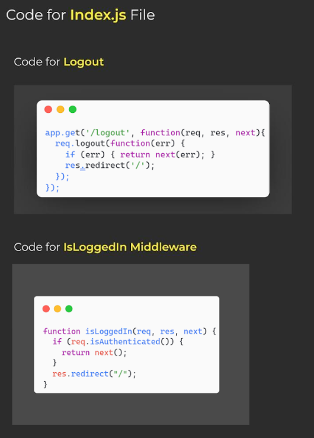
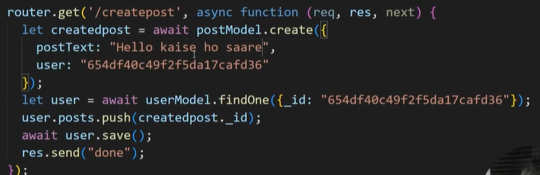
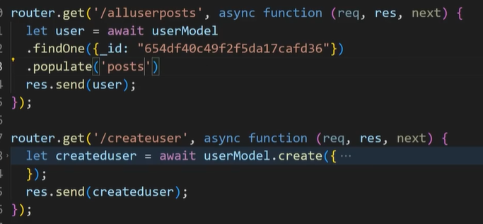

# Backend Development Learning Roadmap

This repository tracks my journey learning Backend Development, covering fundamental networking concepts, **Node.js**, **Express.js**, **MongoDB/Mongoose**, and state management using **Sessions and Cookies**.


## SECTION 1: Networking & Internet Fundamentals

### 1. What is the Internet?

* **Definition:** The Internet is a massive, global network connecting billions of computers and electronic devices worldwide.
* **Origins:** It began in the late 1960s as **ARPANET**, a military project by the US Department of Defense designed to share information securely.
* **Evolution:** It evolved from a basic text-based research network into a multimedia powerhouse (the World Wide Web). Today, it powers global communication, commerce, education, entertainment, and instant information access.

### 2. Ownership of the Internet

* **The Reality:** Nobody owns the Internet. It is a completely **decentralized** network.
* **Control:** No single government or corporation has total control. Instead, it is managed by international non-profit organizations that maintain technical standards and rules.
* *Example:* **ICANN** manages IP addresses and domain names (like `.com` or `.org`) to ensure websites are discoverable.


* **Physical Infrastructure:** While the logical network is decentralized, the physical infrastructure (routers, fiber-optic cables) is owned by private telecom companies and Internet Service Providers (ISPs).

### 3. Data Transfer (Cables & Towers)

* **The Journey:** Data travels primarily through physical infrastructure rather than floating wirelessly through the air.
* **Undersea Fiber-Optic Cables:** Over 95% of international internet traffic travels through massive cables laid on the ocean floor. They use light pulses to transmit huge amounts of data across continents at incredible speeds.
* **Towers & Wi-Fi:** Cellular towers and Wi-Fi routers handle the **"last mile"** of the journey, converting physical signals into radio waves for wireless delivery to devices.

### 4. Packets and Servers

* **Packets:** Data (like photos or text messages) is too large to send all at once. The internet breaks files down into tiny pieces called **packets**. Each packet contains a piece of the data along with the sender and destination addresses. They travel across different network paths and reassemble in the correct order at the destination.
* **Servers:** A server is a high-powered computer that stays turned on 24/7 to "serve" data (websites, videos, files) to client computers whenever requested.

### 5. HTTP vs. HTTPS

* **HTTP (HyperText Transfer Protocol):** The standard protocol used to send data between a web browser and a website. Data is sent in plain text, making it vulnerable to interception.
* **HTTPS (HyperText Transfer Protocol Secure):** The secure version of HTTP. It uses encryption to scramble data during transmission, preventing unauthorized access to sensitive information like passwords or credit card details.

### 6. Ports

* **Definition:** A port is a virtual endpoint where network connections start and end.
* **Analogy:** If your computer’s IP address is like the street address of an apartment building, a **port** is like the specific apartment number.
* **Purpose:** Ports allow a computer to handle multiple types of traffic simultaneously.
* **Port 80:** Regular web traffic (HTTP)
* **Port 443:** Secure web traffic (HTTPS)


---

## SECTION 2: Node.js & NPM Basics

---

## SECTION 2: Package Management (`package.json`)

### 1. Installing Specific Versions

To install a package with a specific version instead of the latest release, append the `@` symbol followed by the version number:

```bash
npm i <package-name>@<version-number>
# Example: npm i express@4.18.2

```

### 2. Dependencies vs. DevDependencies

* **Dependencies:** These are packages absolutely required for your application to run in production. They are built into the final deployed product (e.g., `express`, `mongoose`).
* **DevDependencies:** These are development-only dependencies. They are essential while writing and testing code locally, but are completely stripped out and not required once the application goes live in production.
```bash
npm i nodemon --save-dev
# OR shortcut
npm i nodemon -D

```


### 3. NPM Scripts

Scripts are custom shortcuts defined in the `scripts` object inside your `package.json` file to automate frequent terminal tasks.

* **Default Scripts:** Default commands like `start` and `test` are pre-recognized by NPM and can be run directly:

npm start
npm test


* **Custom Scripts:** If you create your own custom scripts inside `package.json` (such as a script named `dev` to run nodemon), you must use the `run` keyword to execute them:
```bash
npm run dev

```

#### Example Configuration (`package.json`):
"scripts": {
  "start": "node script.js",
  "dev": "nodemon script.js",
  "test": "echo \"Error: no test specified\" && exit 1"
}

### 1. Global vs. Local Installation (`-g`)

* **Globally Installed (`-g`):** Installing a package with the `-g` flag (e.g., `npm i nodemon -g`) makes it accessible across your entire computer. It only needs to be installed once.
* **Locally Installed (Without `-g`):** Omitting the `-g` flag installs the package strictly inside your current project folder (`node_modules`). It must be reinstalled for each new project.

### 2. Essential Commands

* **Running a Server (Standard Node):**
```bash
node .\script.js

```


*Runs the JavaScript file using the Node.js runtime. If you make changes to your code, you must manually restart the server (`Ctrl + C`) to see updates.*
* **Installing Packages:**
```bash
npm i <package-name>
# OR
npm install <package-name>

```


*Downloads and installs a specific package into your project's `node_modules` folder.*
* **Running the Server with Auto-Reload (Nodemon):**
```bash
nodemon .\script.js

```


*Automatically restarts your server every time you save changes to your code.*
* **Alternative Nodemon Execution (Using NPX):**
```bash
npx nodemon .\script.js

```


*If your terminal throws a script execution error for global nodemon, `npx` forces Node to execute the local package directly from your project files.*

---

## SECTION 3: Express.js Core Concepts

### 1. Node.js vs. Express.js

* **Node.js** is the runtime environment that allows you to execute JavaScript on the server side.
* **Express.js** is a minimal, flexible web framework built on top of Node.js. It simplifies route management and HTTP request processing, saving you from writing verbose native code using Node's built-in `http` module.

### 2. Routing

Routing defines how an application responds to a client request at a specific endpoint (URI/path) using a specific HTTP method (`GET`, `POST`, etc.). It dictates which logic executes when a user visits a specific URL.

### 3. Middleware

Middleware is a function that runs **after** the server receives a request, but **before** it sends a response back to the client. It acts as an inspector or a gatekeeper.

* **Capabilities:**
* *Check requests:* Verify if a user is authenticated before allowing access.
* *Modify requests:* Format incoming data, parse cookies, or log request details.
* *Terminate requests:* Block execution and send an early response if validations fail.


* **The 3 Parameters:**
* `req`: The Request object (contains user data, parameters, and bodies).
* `res`: The Response object (handles sending data back to the client).
* `next`: A callback function that passes control to the next middleware or route handler.


### 4. Route Parameters (Dynamic Routing)

To make routes dynamic, use a colon (`:`) at the variable section of the path. Access these values within your handler using `req.params`.

* **Static Pattern Examples:**
* `/author/books/issued/swati`
* `/author/books/issued/sejal`
* `/author/books/issued/shree`


* **Dynamic Route Definition:**

app.get('/author/books/issued/:username', (req, res) => {
    res.send(`Viewing books issued to: ${req.params.username}`);
});


### 5. Template Engines (EJS)

A template engine uses a specific markup style to generate dynamic HTML content.

* *Examples:* EJS, Pug, Handlebars. **EJS (Embedded JavaScript)** uses standard HTML syntax infused with JavaScript tags.

#### Steps to Set Up EJS:

1. **Install EJS:** `npm i ejs`
2. **Configure View Engine in your script:**

app.set("view engine", "ejs");

3. Create a folder named `views` in your root directory.
4. Inside `views`, create your templates with the `.ejs` extension (e.g., `index.ejs`).
5. Render the file in your route instead of sending plain text (do not include the `.ejs` extension in the code):

Code :
app.get('/', (req, res) => {
    res.render("index"); 
});

### 6. Static Files

To serve assets like images, CSS stylesheets, and client-side JavaScript:

1. Create a root folder named `public`.
2. Inside `public`, create three sub-folders: `images`, `stylesheets`, and `javascripts`.
3. Configure Express to serve the static directory:

app.use(express.static("./public"));

### 7. Error Handling

To implement global error handling, paste the standard Express error handler at the end of your middleware chain and customize the output:

app.use((err, req, res, next) => {
  console.error(err.stack);
  res.status(500).send('Something broke on the server!');
});


---

## SECTION 4: Express Generator

The **Express Generator** is a tool that scaffold a pre-configured project folder structure containing all necessary initial files automatically.

### Usage Steps:

1. **Install globally:**

npm i express-generator -g


2. **Generate a new application** (Navigate to your Target Directory, e.g., Desktop):

express my-app-name --view=ejs

3. **Navigate and install dependencies:**

cd my-app-name
npm install

4. **Open in VS Code:**
code .


### Key Variations to Remember when using Express Generator:

* Route mapping switches from standard app handlers to router instances: `app.get` becomes `router.get`.
* Launch application using local script wrappers or npx tools: `npx nodemon`.

---

## SECTION 5: Databases & MongoDB/Mongoose

### Database Classification

* **Relational:** Structure based on tables and rows (e.g., SQL, PostgreSQL).
* **Non-Relational:** Structure based on documents and collections (e.g., MongoDB).


### Concept Mapping

| Application/Code Side | MongoDB Side | Description |
| --- | --- | --- |
| **Database Setup** | Database Formation | The main container for your app data. |
| **Model** | Collection | A grouping of similar data entries (like a table). |
| **Schema** | Document | The structural skeleton defining data rules. |

### Configuration and CRUD Implementation

Install Mongoose via npm: `npm i mongoose`.

#### 1. Schema & Model Definition (`user.js`)

const mongoose = require("mongoose");

// Connect to MongoDB local instance
mongoose.connect("mongodb://127.0.0.1:27017/GitIntelDB");

const userSchema = mongoose.Schema({
  username: String,
  name: String,
  age: Number
});

module.exports = mongoose.model("user", userSchema);

#### 2. CRUD Operations inside Routes (`index.js`)

const express = require('express');
const router = express.Router();
const userModel = require("./user");

// CREATE
router.get('/create', async (req, res) => {
  const createdUser = await userModel.create({
    username: "swati",
    age: 20,
    name: "swati"
  });
  res.send(createdUser);
});

// READ (All Users)
router.get("/allusers", async (req, res) => {
  let allUsers = await userModel.find();
  res.send(allUsers);
});

// READ (Find One Specific User)
router.get("/oneuser", async (req, res) => {
  const oneUser = await userModel.findOne({ username: "swati" });
  res.send(oneUser);
});

// DELETE
router.get("/delete", async (req, res) => {
  let deletedUser = await userModel.findOneAndDelete({ username: "swati" });
  res.send(deletedUser);
});

module.exports = router;


---

## SECTION 6: Sessions and Cookies

Both mechanisms preserve state across requests, but save data in different environments.

| Concept | Storage Location | Environment |
| --- | --- | --- |
| **Cookie** | Client-Side | Web Browser |
| **Session** | Server-Side | Node.js Server Runtime |

### 1. Express Session Setup

1. **Install package:** `npm i express-session`
2. **Configure in `app.js`:**
const session = require('express-session');

app.use(session({
  resave: false,               // Prevents resaving unchanged session states, reducing server load
  saveUninitialized: false,    // Reduces storage overhead by ignoring uninitialized sessions
  secret: "hellloooooo"        // Encryption key utilized to secure session data
}));


3. **Usage inside routes:** 

// Create Session Data
req.session.username = "swati";

// Read Session Data
console.log(req.session.username);

// Delete Session Data
req.session.destroy((err) => {
   res.send("Session cleared");
});


### 2. Cookie Parser Setup

1. The `cookie-parser` dependency comes pre-configured automatically when using the Express Generator.
2. **Usage inside routes:**
// Create Cookie (Saved on browser)
res.cookie("name", "swati");

// Read Cookie
console.log(req.cookies.name);

// Delete Cookie
res.clearCookie("name");


<!-- Flash Messages -->
It is type of warning message when we put wrong information.example on login page you type the email and password wrong then the msg will pop up that the email or password is incorret .

- * flash message ka matlab server ke kisi bhi route me koi data bnana and uss data ko dusre route me use kar pana.
- * flash message allow karta hai ki iss route me bne huve data ko dusre route me use kar sako.

<!-- Steps for it -->
1) install package -> npm i connect-flash
2) make sure you setup express-session
3) make sure you put connect flash in a app.use function after the ecpress function.
- require flash
- then create app.use function
4) create flash in any route
5) on any another route try to run it

<!-- Intermidiate mongodb -->
//case sensitive in mongodb - Regular Expression
- Here we caan use RegExp("Search term value" , flags);
for strictly match there are two symbols we have to use 
^ - how will be the starting
$ - how will be the end

example - new RegExp("^Swati$",'i');

//find documents where an array field contains all of a set of values.
router.get("/find",async(req,res)=>{
    // $all it can search tag more then one . it accept always a array.
  let userfind = await userModel.find({categories: {$all:["app developer"] }});
  res.send(userfind);
});

//Search documents with a specific date range in mongoose
router.get("/find",async(req,res)=>{
  //date format ('yyyy-mm-dd')
  var date1 = new Date('2026-06-15');
  var date2 = new Date('2026-06-16');
  let user = await userModel.find({datecreated:{$gte: date1,$lte : date2}});
  res.send(user);
});

//Filter documents based on the existance of a field in mongoose.

router.get("/find",async(req,res)=>{
  let user = await userModel.find({categories : {$exists:true}});
  res.send(user);
});


// Filter documents based on a specific fields length in mongoose.
router.get("/find",async(req,res)=>{
  let user = await userModel.find({
    $expr:{
      $and:[
        {$gte : [{$strLenCP: '$name'},1]},
        {$lte :[{$strLenCP:'$name'},10]},
      ]
    }
  });
  res.send(user);
});


<!-- Authentication and Authorization -->
<!-- Steps to setup -->
1) install these packages:
- npm i passport passport-local passport-local-mongoose mongoose express-session
2) write app.js code first in app.js file and write it after view engine and before logger.
3) setup users.js the properly.
4) in index.js try register first and then other codes as well.

// Screenshots for code setup - 







<!-- Data association -->
join one model with another model through id.we joint together the closely related data.exchange one model id to another model id.

for getting userid :-
type: mongoose.Schema.Types.ObjectId
ref:'Post' // the model name where we want to refer from






<!-- File System in node.js -->